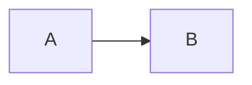
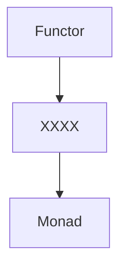

Haskellは勉強したけど**モナドを本当に理解したって言えるのか自信がない…**

**＼そんな人向けの試験問題を作りました！／**

これから実施する試験問題を、**10問中8問正解**すればあなたはHaskellのモナドを完全に理解しています。**私が保証します！**

それではさっそく〜〜


## 第一問

まずは緊張をほぐしましょう。

> Haskellの `Monad` は○○○○である

○○○○に当てはまるのは以下の選択肢のうちどれでしょう？

1. 型
2. 関数
3. 型クラス
4. 型シノニム

:::details 答え
**3. 型クラス**

これは簡単ですね！

Haskellのモナドは単なる型クラスです。
:::

## 第二問

```haskell
class A t => B t where
    ...
```

このような型クラス制約の関係を



のようなグラフで表すとします。この時（GHC 9.0.1において）



XXXX に当てはまる型クラス、つまり`Monad`の型クラス制約は何でしょう？

1. `Pointed`
2. `Applicative`
3. `Alternative`
4. `Traversable`

:::details 答え
**2. Applicative**

これは余談ですが、実は Haskell 2010 Language Report では `Monad` に型クラス制約はありません。今の Applicative の型クラス制約は Functor-Applicative-Monad Proposal によって GHC 7.10 から実装されたものです。
:::

## 第三問
以下の型クラスの定義で`???`となっているbind演算子の型は何でしょう？

```haskell
class Functor f where
    fmap :: (a -> b) -> (f a -> f b)

class Functor f => Applicative f where
    pure  :: a -> f a
    (<*>) :: f (a -> b) -> (f a -> f b)

class Applicative m => Monad m where
    (>>=) :: ???
```

1. `m a -> m a -> m a`
2. `(a -> m a) -> m a`
3. `(a -> m b) -> f a -> m (f b)`
4. `m a -> (a -> m b) -> m b`

:::details 答え
**4. `m a -> (a -> m b) -> m b`**

1は`MonadPlus`、2は`MonadFix`、3は`Traversable`のメソッドの型です。
:::

## 第四問
モナドは型クラスですがその実装はモナド則と呼ばれる関係を満たすことが暗に要請されます。

モナド則は以下の2つと

```haskell
1. pure x >>= f    === f x
2.      m >>= pure === m
```

あと一つは何でしょう？（ただし`===`は左右の値が等しいことを表します）

1. `(m >>= f) >>= g === m >>= (\x -> f x >>= g))`
2. `pure id >>= (\f -> m >>= (\x -> f x)) === m`
3. `pure (g . f) >>= (\h -> m >>= (\x -> h x)) === (pure g >>= (\h -> m >>= (\x -> h x))) . (pure f >>= (\h -> m >>= (\x -> h x)))`
4. `u >>= (\f -> pure x >>= (\x -> f x)) === pure ($ x) >>= (\f -> u >>= (\x -> f x))`

（これは捨て問かも…）

:::details 答え
**1. `(m >>= f) >>= g === m >>= (\x -> f x >>= g))`**

このモナド則があることでアクションを合成する結合順序を気にする必要がなくなるので、一部だけ関数に分けたりできることが保証されている便利な法則ですね。

2と3はFunctor則における

```haskell
fmap id === id
fmap (g . f) === fmap g . fmap f
```

を書き換えたものです。

4も同様にApplicarive則における

```haskell
u <*> pure y === pure ($ y) <*> u
```

を書き換えたものです。
:::

## 第五問
モナドは単なる型クラスですが、Haskellではdo構文という特殊なシンタックスが用意されているという点では特別です。

ですがdo構文は単なる糖衣構文なので簡単にdo構文を使わないコードに変換することができます。

```hs
main = do
    putStrLn "What is your name?"
    name <- getLine
    let message = "Hello " ++ name
    putStrLn message
```

上記のコードと同じ挙動を示す正しいコードは以下のうちどれでしょう。

```hs
1. main = putStrLn "What is your name?" >>=       getLine    (\name -> let message = "Hello " ++ name in        putStrLn message)
2. main = putStrLn "What is your name?" >>=       getLine >>= \name -> let message = "Hello " ++ name in        putStrLn message
3. main = putStrLn "What is your name?" >>= \_ -> getLine >>= \name -> let message = "Hello " ++ name >>= \_ -> putStrLn message
4. main = putStrLn "What is your name?" >>= \_ -> getLine >>= \name -> let message = "Hello " ++ name in        putStrLn message
```

:::details 答え
```haskell
4. main = putStrLn "What is your name?" >>= \_ -> getLine >>= \name -> let message = "Hello " ++ name in        putStrLn message
```

他の選択肢はエラーになり実行できません。
:::

## 第六問
同じdo構文の中では同じモナドの関数しか使うことはできません。
以下のコードにおける2つのdo構文はそれぞれ何のモナドのdo構文でしょう？


1. ① Maybe,    ② Either
2. ① Either,   ② IO
3. ① Either,   ② Maybe
4. ① Identity, ② Maybe

:::details 答え
**3. ① Either, ② Maybe**

コード中のdo構文が何のモナドのdo構文なのか意識するようになると、モナドがどんどん文脈のように見えてきますね。
:::

## 第七問
リストモナドに関する問題です。

0から9の4つの数字で加減乗除（+, ×, -, ÷）により10が計算できる組み合わせを列挙するプログラムを考えましょう（車のナンバープレートで暇な時にやるやつですね）

`make10` で使われている `guard` はリストモナドの中で使用され、第一引数の真偽値がTrueの時だけそれ以降の処理が実行される関数です。

以下のプログラムを完成させるために `guard` を実装してください。


```hs
guard :: Bool -> [()]
guard = undefined

make10 :: [[Double]]
make10 = do
    x   <- [0..9]
    op1 <- [(+), (*), (-), (/)]
    y   <- [0..9]
    op2 <- [(+), (*), (-), (/)]
    z   <- [0..9]
    op3 <- [(+), (*), (-), (/)]
    w   <- [0..9]
    let result = x `op1` y `op2` z `op3` w

    -- result が10に一致しなければこれ以降の処理は実行されない
    guard $ result == 10

    pure [x, y, z, w]

main :: IO ()
main = mapM_ print (take 5 make10)
```

実行するとこのように動きます。

```hs
> runhaskell Main.hs
[0.0,0.0,1.0,9.0]
[0.0,0.0,2.0,8.0]
[0.0,0.0,2.0,5.0]
[0.0,0.0,3.0,7.0]
[0.0,0.0,4.0,6.0]
```

実装が正しいか確認する時はRepl.itを利用するのが手っ取り早いのでぜひ活用してください
<https://replit.com/new/haskell>

:::details 答え
```hs
guard :: Bool -> [()]
guard False = []
guard True  = [()]
```

ちなみに `guard` はリストだけでなく`Alternative`という型クラスに関する関数として一般化することができます。

```hs
guard :: Alternative f => Bool -> f ()
```
:::

## 第八問
モナドの中でも難解な部類に入るStateモナドを何も見ずに実装してください！

下記コードの `undefined` になってる部分を埋めてください。

```hs
newtype State s a = State { runState :: s -> (a, s) }

instance Functor (State s) where
    fmap f (State g) = State $ \s ->
        let (  a, s') = g s
         in (f a, s')

instance Applicative (State s) where
    pure a = State $ \s -> (a, s)
    (State f) <*> (State g) = State $ \s ->
        let (  h, s' ) = f s
            (  a, s'') = g s'
         in (h a, s'')

instance Monad (State s) where
    (State f) >>= m = undefined
```

迷った時はStateモナドにおける`(>>=)`の型を書いてみましょう。

:::details 答え
```hs
instance Monad (State s) where
    (State f) >>= m = State $ \s ->
        let (a, s') = f s
         in runState (m a) s'
```
Applicativeの実装に比べると簡単ですね！
:::

## 第九問
全く知らない型が出てきたとしても、その型が `Monad` のインスタンスになっていればある程度使い方が分かることもあります。

以下ではRedisと呼ばれるDB（Key-Value ストア）を考えましょう。Redis は辞書(Map)というデータ構造のように特定のKeyに紐づけて値（Value）を保存することができるDBです。

- Redis に値を保存する関数
- Redis から値を取得する関数

として以下のような関数が与えられてるとします。

```hs
-- | Redis に値を保存する関数
set :: String   -- 値のKey
    -> String   -- 保存する値
    -> Redis ()

-- | Redis から値を取得する関数
get :: String                -- 値のKey
    -> Redis (Maybe String)  -- 取得した値（Keyが存在しなければ Nothing が返る）
```

そして `Redis` という型は以下のように `Monad` のインスタンスであることがドキュメントより確認できているとします。


この時、上記の関数を利用して以下のような振る舞いをする関数を実装してください。

- Redis から `"foo"` という Key の値を取得する
- 値が存在すればその値を、存在しなければ `"hoge"` という値を `"bar"` という Key に保存する

```hs
example :: Redis ()
example = do
   ...
```

:::details 答え
```hs
example :: Redis ()
example = do
   mvalue <- get "foo"
   case mvalue of
     Just value -> set "bar" value
     Nothing    -> set "bar" "hoge"
```

`Monad` のインスタンスであることが分かれば型の詳細を知らなくても、その型の値と関数を合成する方法が分かるのです。

この問題は [hedis](https://hackage.haskell.org/package/hedis) という実際のライブラリを元に作成しています。

実際、このようにして作った `example` 関数は

```hs
runRedis :: Connection -> Redis a -> IO a
```

という関数を利用して`IO`に変換し実行することができます。`Connection` は接続情報などが含まれているデータ型です。
:::

## 第十問
base にある `Control.Monad` モジュールでは以下のような関数が提供されています。

```hs
join :: Monad m => m (m a) -> m a
```

この関数は `(>>=)` を使って

```hs
join m = m >>= id
```

のように実装することができます。

反対に、先に `join` が与えられたとすると `join` を使って `(>>=)` すなわち `Monad` のインスタンスを実装することができます。

`join` を使って `(>>=)` を実装してみてください。ただし `Functor` や `Applicative` のメソッドは使っても良いこととします。

```hs
instance Monad m where
    m >>= k = undefined
        where
            join :: m (m a) -> m a
            join = {- この実装は既知とします -}
```

:::details 答え
```hs
instance Monad m where
    m >>= k = join (fmap k m)
        where
            join :: m (m a) -> m a
            join = {- この実装は既知とします -}
```

このように `(>>=)` と `join` は片方が定義されていれば、もう片方の実装は自動的に導かれます。

原理的には `Monad` のメソッドとして `(>>=)` ではなく `join` を採用することもできるのです。

> モナドは単なる自己関手の圏におけるモノイド対象だよ。何か問題でも？

という言い回しがありますが `join` はこの `モノイド対象` に深く関わってくる関数でもあります。
:::

----

これにて試験終了です！いかがだったでしょうか？

10問中8問正解していればHaskellのモナドを完全に理解しています！
日常生活で `Monad` を使う上で何にも困らないでしょう👀

残念ながら8問解けなかった人、別に何か起こるわけでもないので気にしないでください😅
あくまでこの記事は難解と良く言われるHaskellのモナドを理解できているかの目安に使っていただけるとありがたいので、もし勉強不足を感じていたら復習して再チャレンジしてみてください。世の中には数多のモナドチュートリアルが存在するので勉強のネタには困らないでしょう。入り口がわからない人は[こちらのリンク集](http://lotz84.github.io/haskell/functor-applicative-monad)も参考にしてください。

8問以上正解できた人おめでとうございます！
「完全に理解した」からさらに先にある「何もわからん。チョットワカル」を目指して頑張ってください👏（言わずもがなですがここらへんの言い回しは[「ダニング＝クルーガー効果」](https://www.google.com/search?q=%E3%83%80%E3%83%8B%E3%83%B3%E3%82%B0%EF%BC%9D%E3%82%AF%E3%83%AB%E3%83%BC%E3%82%AC%E3%83%BC%E5%8A%B9%E6%9E%9C)を参照）

[何問解けたかは忘れずにツイートしいってくださいね！](https://twitter.com/intent/tweet?text=%E5%95%8F%E6%AD%A3%E8%A7%A3%E3%81%97%E3%81%BE%E3%81%97%E3%81%9F%EF%BC%81%EF%BC%8F%0A%E3%80%8CHaskell%E3%81%AE%E3%83%A2%E3%83%8A%E3%83%89%E5%AE%8C%E5%85%A8%E3%81%AB%E7%90%86%E8%A7%A3%E3%81%97%E3%81%9F%E3%80%8D%E8%A9%A6%E9%A8%93%E5%95%8F%E9%A1%8C%0Ahttps%3A%2F%2Fzenn.dev%2Flotz%2Farticles%2Ffd7cdb6c539d56ac595c)

----

＼読んでいただきありがとうございました！／

この記事は「第87回Haskell-jpもくもく会 @ オンライン」の時間を利用して書かれました。

Haskell-jpでは2021年11月7日に [Haskell Day 2021](https://haskell.jp/haskell-day-2021/) というオンラインイベントも開催するのでチェックしてみてください！

この記事が面白かったら いいね♡ をいただけると嬉しいです☺️
100円からでも サポート¥ をいただければ次の記事を書くため励みになります🙌

[^1]: Haskellでコンパイル時に素数判定を行う方法が解説されている記事はこちら ["コンパイル時に素数判定を行ってみた - Qiita"](https://qiita.com/autotaker1984/items/f5cc8914e051563a86f9)
